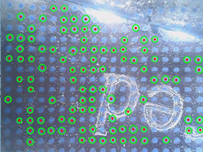

# 钥匙和汤匙相关的数据集
相关采集和分析软件在https://github.com/tsinghua-rll/dataset_op_software.git
## 文档说明
```
    0~2 文件夹是钥匙相关的数据，共三把钥匙
    3~6 文件夹存放4把汤匙的数据
    最终版/中还有以旋转为分类的文件
```
## 数据集相关工作
### 物体分类识别

#### 预处理

​		标记点的存在会对识别造成干扰，这是由于标记点提供的是对分类无效的信息。我们希望通过预处理把标记点的干扰消除。
​		首先，我们将图片进行二值化，变成只有黑白两种颜色的效果。而后进行腐蚀，把较小的离散溅射点去除。但此时图像受到了较大的损失，于是我们对剩下的图像进行膨胀操作，基本将离散点去除。之后再进行高斯模糊，让二值化的图像显得柔和，加上边缘提取，进一步降低特征空间的大小。

#### 基于一般卷积神经网络的分类算法

​		卷积神经网络(CNN)在传统的图像任务中已经证明了其优秀的性能,但它在纹理的相关任务上的研究并不多。作为对比,我们首先尝试直接在本任务中使用用于常规图像的 CNN 结构进行测试,再根据其中存在的问题加以讨论和改进。
​		作为对比,我们尝试了在图像任务中常用的 AlexNet ,VGG16 和近年来在图像任务上表现出色的 ResNet三种架构。对于480*640的原图，进行2次下采样，得到120*160输入网络。考虑到数据集的规模,为避免过拟合,本任务并不适合参数空间过大的网络,最终我们使用的网络结构比较简单，如下表


| 网络名称            | 输出大小  | 具体细节       |
| ------------------- | --------- | -------------- |
| Conv1               | 16*28*28  | Kernel：(5*5） |
|           |           |Maxpooling                |
|             |           |Relu输出                |
|  |           |Batch_normalization                |
| Conv2               | 32*60*80  | Kernel：(5*5） |
|           |           |Maxpooling                |
|             |           |Relu输出                |
|  |           |Batch_normalization                |
| Conv3               | 64*15*20  | Kernel：(5*5） |
|           |           |Maxpooling                |
|             |           |Relu输出                |
|  |           |Batch_normalization                |
| Conv4               | 128*15*20 | Kernel：(5*5） |
|           |           |Maxpooling                |
|             |           |Relu输出                |
|  |           |Batch_normalization                |
| Conv5               | 256*15*20 | Kernel：(5*5） |
|           |           |Maxpooling                |
|             |           |Relu输出                |
|  |           |Batch_normalization                |
|       |           | Dropout（0.8） |
| Conv6               | 512*15*20 | Kernel：(5*5） |
|           |           |Maxpooling                |
|             |           |Relu输出                |
|  |           |Batch_normalization                |
|       |           | Dropout（0.7） |
| Dense1              | 1024      | 15360×1024     |
|       |           | Dropout（0.7） |
|             |           | Relu输出 |
| Dense2              | 7         | 1024×4         |


### 温度识别

​		首先使用opencv中的hough圆变换获得标记点位置，然后再使用svm对标记点范围内的像素点的颜色进行分类，svm的训练集从图片中截取像素点得到，最后根据标记点范围内的像素点的颜色分类结果投票来确定接触物体的温度。温度-颜色对应范围为：黑色-低温，紫色-较低温， 蓝色-常温， 白色-高温。如图：



<center>图 hough圆变换</center>


​		由于一部分标记点和周围的对比度不明显，另一部分标记点不够圆，hough圆变换不能检测到所有标记点，但是由于我们的任务只需要找对标记点区域并根据区域内的像素值进行svm分类，hough圆变换足以完成这一任务。

### 手内姿态估计

#### 以钥匙为例边缘复杂的物体

​    此类物体边缘难以捕捉，往往不能直接通过边缘来判定物体在手内的具体姿态，需要对所采集到的物体局部图像进行定位来判定它在手内的具体姿态。
​    希望通过将采集到的局部图片拼接，再进一步匹配所采集的当前图片在物体（即钥匙）的相对坐标。
​    由于传感器溅射点和标记点对拼接也造成相当大的干扰，这里我们也需要做类似的预处理操作，从而减弱溅射点和标记点对结果的影响。

#### 以勺子为例边缘平直的物体

​		这里不同于前一类物体，它的边缘平直，往往可以直接检查。通过检测边缘，将图片的具体姿态识别出来。
​		这里以勺子为例，一般在采集的过程中可以捕捉到边缘。由于边缘平直，我们采用hough线变换将线提取出来，计算出提取出来的线和水平方向的夹角，得出该类物体在手内的具体姿态。 

### 基于感知的操作

​		人类开锁的过程大概可以分成三步。第一，选择一把合适的钥匙；第二，将这把钥匙以合适的角度插入钥匙孔；第三，旋转钥匙开锁。
​		机器人开锁的过程也无法脱离这三步。尤其在前两步过程中，触觉传感器将扮演重要的角色。利用我们前面所做的钥匙分类算法，我们可以选择合适的钥匙，利用手内姿态估计算法，我们可以将钥匙调整到合适的位置，最终插入钥匙孔。这两步过程中所需的信息都是传统触觉传感器所无法感知的。

### 实验结果展示

图 8 种类分类、温度辨别及姿态估计结果

    我们对勺子的实测种类分类、温度辨别及姿态估计结果显示在界面上，我们的开锁实验视频也展示在附件中。
## 下一步工作

### 主动感知

​    	以上对基本物体分类，是通过对物体的局部信息得出的。这是不全面的，但又是难免的，因为放在指尖的触觉传感器大小毕竟十分有限，往往不可能可以看到对应物体的全貌。
​    	但类比于人的触觉系统，我们往往可以通过触摸一个物体最为特殊的区域来识别对应物体，同样机器也应该可以。
​		为实现这个目标，我们需要在系统中加入主动感知的策略，即在采集一个图片后能有策略向特定方向移动，去寻找对应物体的特征点。
​		如果把一次摸取的结果作为一个状态s，所要移动的方向作为一个动作a，我们就可以得到状态序列对，将它和不同物体的匹配程度作为奖励，从而用深度强化学习的方法学习一个最佳策略。

### 扩大局部感受域

​		未来的主动感知操作还需要我们处理传感器局部信息与整体的关系。我们的传感器大小有限，不可能一次覆盖物体表面，因而每次接触感受到的都是物体表面的局部信息，为了扩大感受域，充分利用局部信息，需要一个类似于“盲人摸象”的过程。我们可以利用图片的特征点匹配方法，实现不同感受域之间的拼接或匹配，进而为机器人的主动感知操作提供位置的感知。
​		一般的特征点匹配方法（如基于FLANN和SIFT特征的匹配）在我们的场景下遇到了困难，这也是我们过去面临的主要困难之一，即由于1. 标记点的存在造成干扰；2. 不同两次接触的感知图片实际上并不完全一样，特征点匹配一般仅有50-70%的准确率。由于我们触觉感知图片的特点（没有焦距和拍摄角度的变化），因而每张图片的正确特征点连线与其它图片对应全等。我们下一步希望结合这个特点来筛选正确的特征点，并应用于局部感受域的拼接或定位任务。